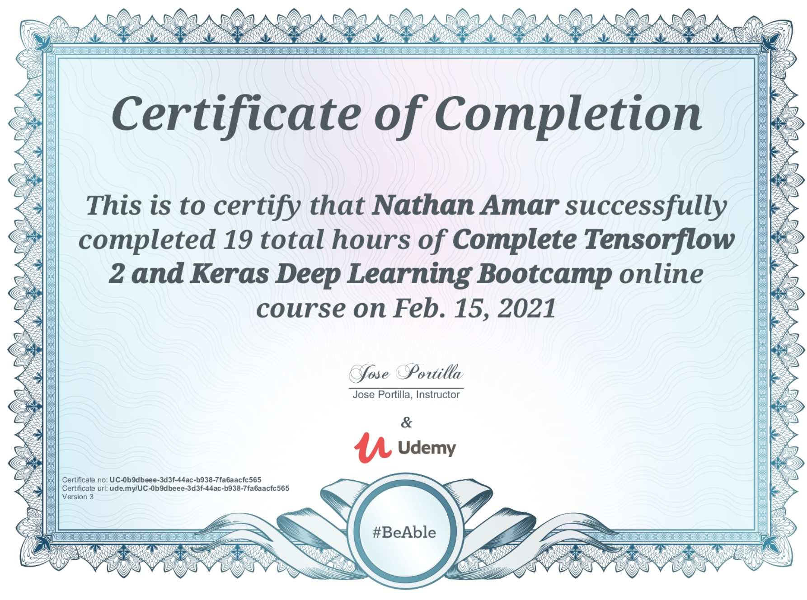
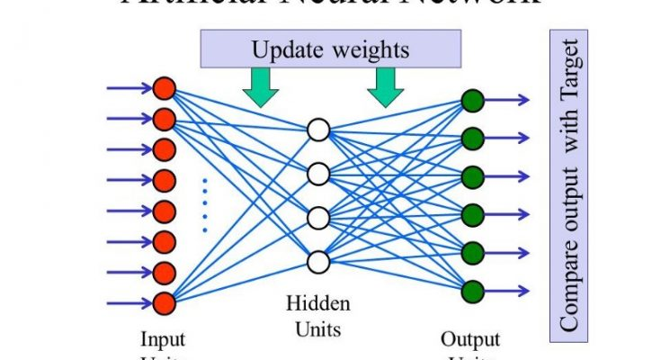
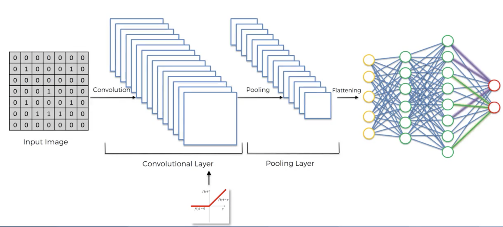
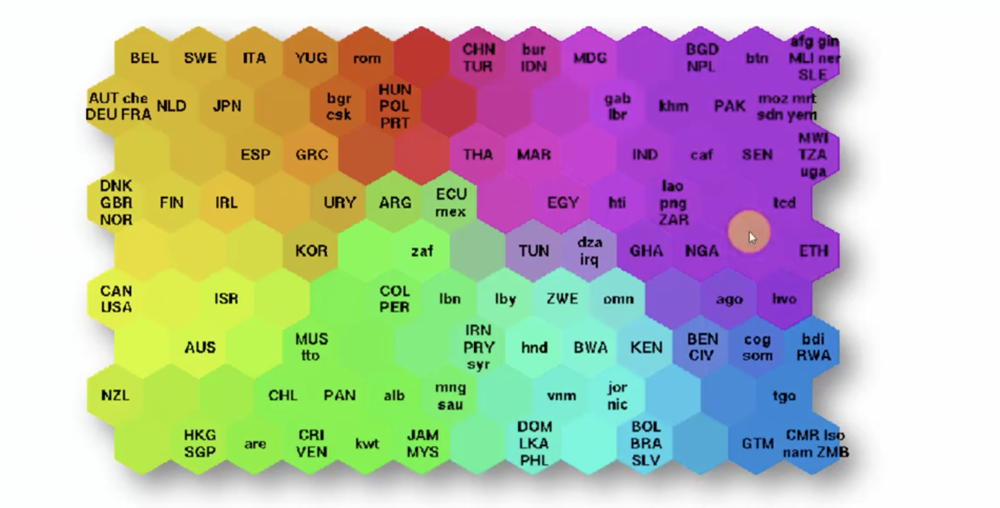

## Deep Learning certificate

## Deep_Learning

### This repository contains examples of popular deep learning algorithms implemented in Python.

## Artificial Neural Networks

In this part you will learn:

- The Intuition of ANNs

- How to build an ANN

- How to predict the outcome of a single observation (Homework Challenge)

- How to evaluate the performance of an ANN with k-Fold Cross Validation

- How to tackle overfitting with Dropout

- How to do some Parameter Tuning on your ANN to improve its performance

## Convolutional Neural Networks

In this part you will learn:

- The Intuition of CNNs

- How to build an CNN

- How to predict what is inside a single image (Homework Challenge)

- How to improve a CNN

## Recurrent Neural Networks

In this part, we will take part in a real R&D process to build a robust and relevant Recurrent Neural Network. Here is the plan of attack:

- We will study the theory and get the Intuition of RNNs.

- We will start by building a simple RNN, our first attempt.

- We will observe the results to identify possible issues and ways of improvement, so that eventually this simple RNN will be well improved in the last section.

- We will learn how to evaluate a RNN model, and more generally a Regression model.

# Self Organizing Maps

In this part you will learn:

- The Intuition of SOMs

- How to build a SOM

- How to return the specific features (like frauds) detected by the SOM

- How to make a Hybrid Deep Learning Model

*Let's see an example*

