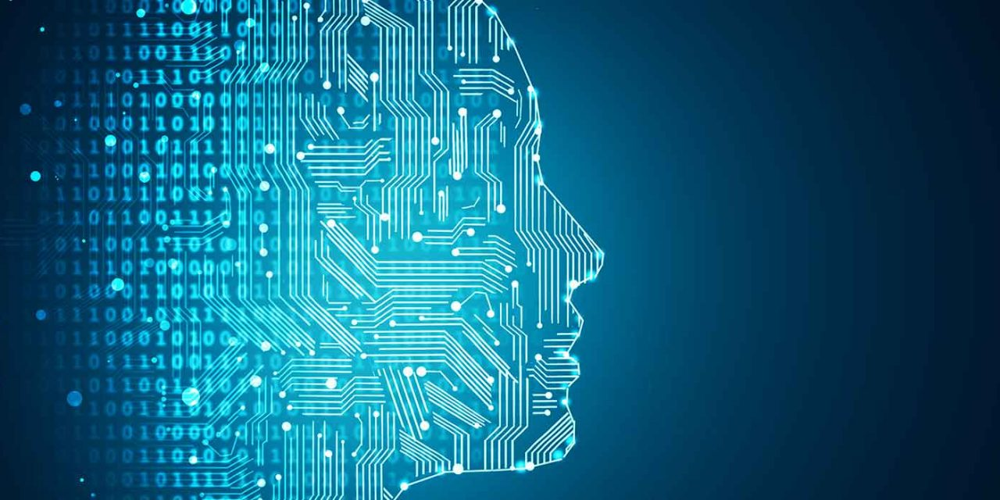

# Deep_Learning

### This repository contains examples of popular deep learning algorithms implemented in Python.

## Artificial Neural Networks

In this part you will learn:

- The Intuition of ANNs

- How to build an ANN

- How to predict the outcome of a single observation (Homework Challenge)

- How to evaluate the performance of an ANN with k-Fold Cross Validation

- How to tackle overfitting with Dropout

- How to do some Parameter Tuning on your ANN to improve its performance

## Convolutional Neural Networks

- In this part you will learn:

- The Intuition of CNNs

- How to build an CNN

- How to predict what is inside a single image (Homework Challenge)

- How to improve a CNN